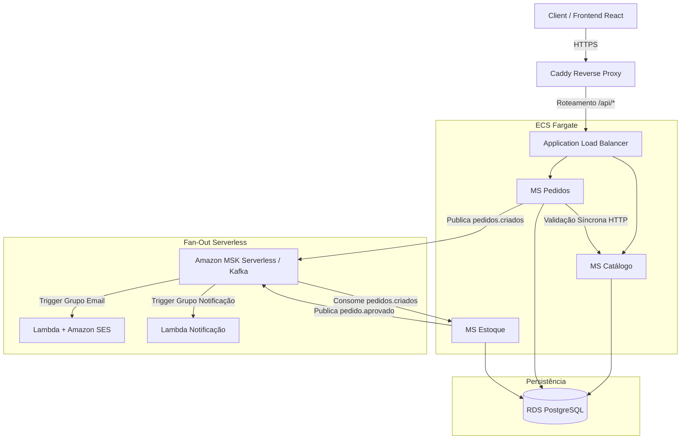

# 🛒 OmniShop - Plataforma de E-commerce Baseada em Microsserviços e Arquitetura Orientada a Eventos na AWS

O **OmniShop** é um projeto acadêmico focado no desenvolvimento de uma plataforma de e-commerce robusta, altamente escalável e resiliente. O objetivo principal é aplicar padrões modernos de engenharia de software de nível corporativo, utilizando uma **arquitetura de microsserviços descentralizada**, mensageria de alta performance com **Apache Kafka**, e infraestrutura de nuvem na **AWS** provisionada via **Terraform**.

Diferente de sistemas monolíticos tradicionais, o OmniShop divide as regras de negócio em serviços totalmente independentes que se comunicam de forma assíncrona, garantindo que o sistema seja tolerante a falhas e preparado para cenários de alta demanda (como uma Black Friday).

---

## 🏗️ Visão Geral da Arquitetura

O desenho técnico do sistema adota os principais padrões de mercado para sistemas distribuídos e práticas de DevOps:

### 🛠️ Stack Tecnológica & Componentes

*   **Frontend:** React (Vite) empacotado e servido via container Nginx.
*   **Backend:** Microsserviços desenvolvidos com **Java 21** e **Spring Boot** (Catálogo, Pedidos e Estoque).
*   **Mensageria & Eventos:** **Apache Kafka** atuando como o coração assíncrono do sistema. Utiliza Redpanda localmente para desenvolvimento e **Amazon MSK Serverless** em ambiente de produção.
*   **Padrões de Resiliência no Kafka:** Implementação de grupos de consumidores (*consumer groups*) para estratégias de *fan-out*, tópicos de relesitura/DLT (*retry-topic/DLT*) com 3 tentativas, controle de commits manuais e garantia de **idempotência** no processamento de pedidos.
*   **Computação e Serverless:** Servidores gerenciados via **Amazon ECS Fargate** (sem EC2). Fluxos complementares e orientados a eventos utilizam **AWS Lambda** integrada ao **Amazon SES** (para disparos de e-mails de confirmação) e expostas por **Amazon API Gateway**.
*   **Infraestrutura como Código (IaC):** Toda a infraestrutura da AWS é descrita de forma reprodutível e automatizada através do **Terraform**.
*   **Segurança e Ingress:** Autenticação baseada em **JWT**, descoberta interna via **AWS Cloud Map** e terminação HTTPS gerenciada via servidor web **Caddy** (Let's Encrypt) acoplado ao ALB.
*   **Observabilidade:** Coleta de métricas e monitoramento através de **Prometheus**, **Grafana** e **CloudWatch Container Insights**.

---

## 📈 Roadmap de Desenvolvimento (Cronograma de 57 dias)

O projeto está estruturado em fases incrementais com entregáveis claros estabelecidos ao fim de cada ciclo:

| Fase | Descrição e Foco Tecnológico | Entregável Esperado | Status |
| :---: | :--- | :--- | :---: |
| **0** | **Setup do Ambiente:** AWS CLI, Docker, JDK 21, DuckDNS e AWS Budgets. | Ambiente e alertas de custos configurados. | ⏳ |
| **1** | **MS Catálogo:** Criação do primeiro CRUD utilizando Spring Data JPA e PostgreSQL. | CRUD de produtos validado via Postman. | ⏳ |
| **2** | **MS Pedidos:** Comunicação HTTP síncrona com MS Catálogo via WebClient. | Fluxo de criação de pedido com validação ativa. | ⏳ |
| **3A** | **Kafka Local (Broker):** Configuração do Redpanda no Docker e criação de tópicos. | Broker rodando e testes manuais de eventos. | ⏳ |
| **3B** | **Mensageria Avançada:** Integração Pedidos ➡️ Estoque, tratamento de DLT e idempotência. | Fluxo assíncrono funcional com resiliência local. | ⏳ |
| **4** | **Fan-out:** Múltiplos consumer groups independentes lendo o mesmo tópico. | Evento único disparando ações isoladas simultâneas. | ⏳ |
| **5** | **Serverless:** AWS Lambda consumindo MSK para envio de e-mails via Amazon SES. | Lambda integrada com SES e API Gateway. | ⏳ |
| **6** | **Frontend React:** Construção da interface do usuário (Listagem ➡️ Carrinho ➡️ Checkout). | Interface web integrada com as APIs locais. | ⏳ |
| **7** | **Deploy AWS (ECS & MSK):** Migração para nuvem por meio de containers Fargate e MSK. | E-commerce público e acessível via HTTPS. | ⏳ |
| **8** | **Terraform & Testes:** Automação completa da Infra as Code e testes de integração. | Infraestrutura modularizada com 1 comando de setup. | ⏳ |
| **9** | **Portfólio:** Documentação final, diagramas refinados e gravação de demonstração. | Repositório pronto e portfólio publicado. | ⏳ |

---

## 💰 Gerenciamento de Custos (Regra de Ouro)

Para manter o orçamento estrito de **no máximo R$ 100/mês**, o projeto adota uma arquitetura híbrida de desenvolvimento:
1. **Regime de Desenvolvimento (Fases 0 a 6):** Execução 100% local via Docker Compose (custo R$ 0). Serviços AWS utilizados apenas dentro do limite do *Free Tier* (S3, Lambda, RDS micro).
2. **Regime de Demonstração/Deploy (Fases 7 e 8):** Serviços pagos da AWS (ECS Fargate, ALB, MSK Serverless) são provisionados estritamente em janelas de demonstração e testes, sendo completamente destruídos via `terraform destroy` logo em seguida.

---

## 🚀 Como Executar Localmente (Breve)
*(Instruções detalhadas de execução com Docker Compose serão adicionadas ao concluir a Fase 3).*
